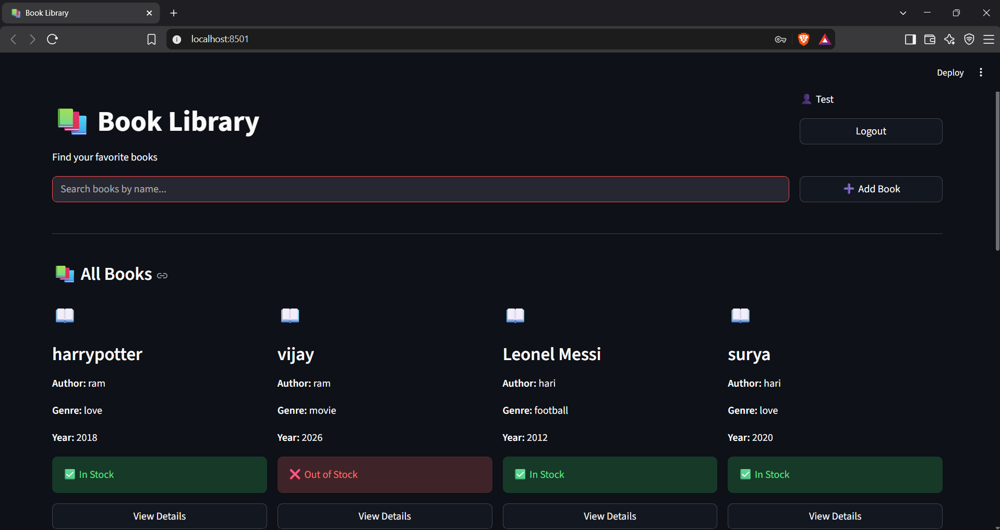
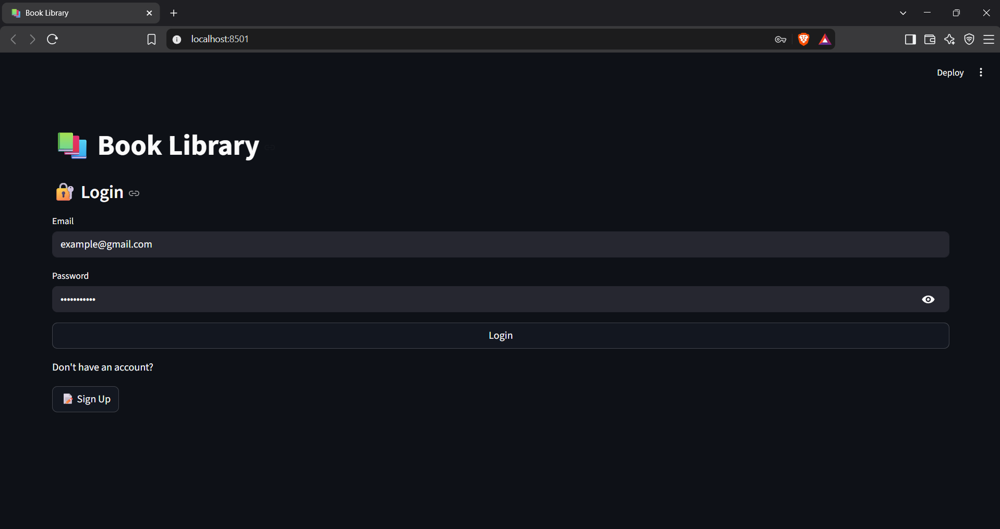
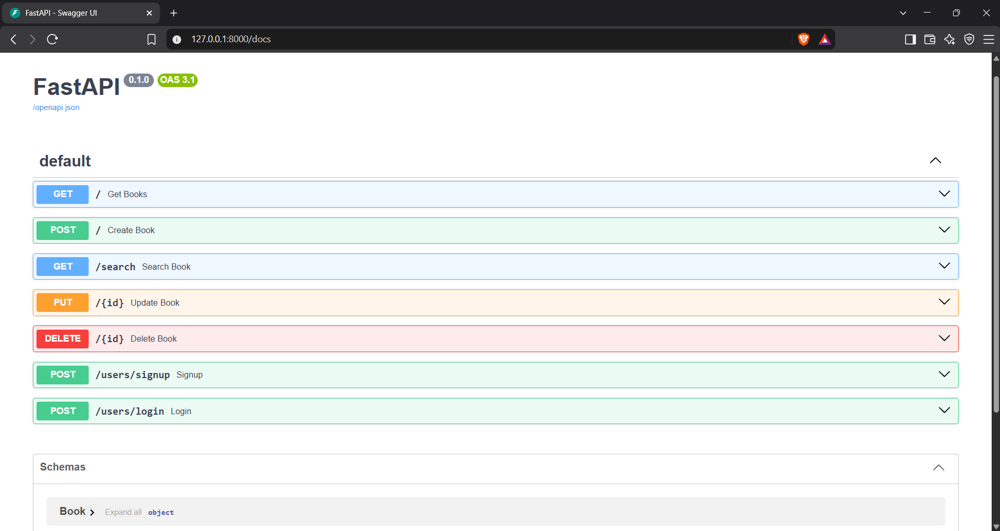

# 📚 Book Library

A full-stack Book Library application built with **FastAPI, MongoDB, and Streamlit**.

The backend provides a REST API for user accounts and book management. The Streamlit frontend has an ecommerce-style layout for browsing, searching, adding, editing, and deleting books.

## Features

- User signup and login with bcrypt password hashing
- View all books in an ecommerce-style grid
- Search books by title
- Add, edit, and delete books
- Track book stock status
- View individual book details
- MongoDB storage, with the connection string kept in an environment variable

## Tech Stack

| Layer      | Technology                    |
| ---------- | ----------------------------- |
| Backend    | Python, FastAPI, Uvicorn      |
| Database   | MongoDB, PyMongo              |
| Validation | Pydantic                      |
| Security   | bcrypt                        |
| Frontend   | Streamlit, Requests           |
| Config     | python-dotenv                 |

## Project Structure

```
Book-Library-API/
├── backend/
│   ├── main.py
│   ├── models/        # Pydantic models and database connection
│   ├── router/        # API routes (books, users)
│   ├── schemas/       # Serializers and request schemas
│   └── requirements.txt
├── frontend/
│   ├── app.py         # Streamlit app
│   └── requirements.txt
├── docs/
│   └── screenshots/
└── README.md
```

## API Endpoints

| Method   | Endpoint            | Purpose               |
| -------- | ------------------- | --------------------- |
| `POST`   | `/users/signup`     | Create an account     |
| `POST`   | `/users/login`      | Log in                |
| `POST`   | `/`                 | Add a new book        |
| `GET`    | `/`                 | Get all books         |
| `GET`    | `/search?title=...` | Search books by title |
| `PUT`    | `/{id}`             | Update a book         |
| `DELETE` | `/{id}`             | Delete a book         |

Interactive API docs are available at `http://127.0.0.1:8000/docs` when the backend is running.

## Setup

1. Clone the repository:
```
   git clone https://github.com/harrrypottter10/Book-Library-API.git
   cd Book-Library-API
```

2. Start the backend:
```
   cd backend
   pip install -r requirements.txt
```
   Create a `.env` file inside `backend/`:
```
   MONGO_URL=your_mongodb_connection_string_here
```
   Then run:
```
   python -m uvicorn main:app --reload --port 8000
```

3. In a second terminal, start the frontend:
```
   cd frontend
   pip install -r requirements.txt
   python -m streamlit run app.py
```

4. Open `http://localhost:8501` in your browser.

## Screenshots





## Future Improvements

- JWT authentication for the book routes
- Docker support
- Automated tests